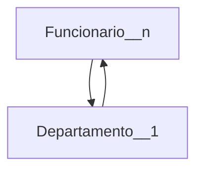
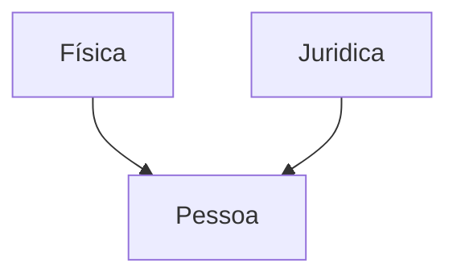

# Apresentação da disciplina
### UNIDADE 1 - BANCO DE DADOS ATIVOS
- Conceitos
- Modelo ECA
- Automatismos
- Utilização em um SGBD convencional
### UNIDADE 2 - SEGURANÇA E INTEGRIDADE
- Conceitos
- Permissões
- Visões
- Procedimentos armazenados
### UNIDADE 3 - BANCO DE DADOS TEMPORAIS
- Conceitos
- Consultas temporais
- Modelo temporais
- Implementação em um SGBD convencional
### UNIDADE 4 - BANCO DE DADOS OBJETO-RELACIONAL
- Conceitos
- Modelo relacional estendido
- Utilizsação em um SGBD convencional
### UNIDADE 5 - OTIMIZAÇÃO DE CONSULTAS
- Conceitos
- Indexação
- Principais algoritmos
### UNIDADE 6 - PROCESAMENTO DE TRANSAÇÕES
- Conceitos
- Controle de concorrência
- Sistema de recuperação
  
# Revisão de banco de dados
### Banco de dados 
* Coleção de dados relacionados, por dados entende-se fatos conhecidos que podem ser armazenados e têm um significado implícito
* Propiedades implícitas de um banco de dados
  * representa algum aspecto do mundo real
  * é uma coleção de dados logicamente coerente
  * é projetado, construído e populado para um propósito específico
* Banco de dados podem ser de qualquer tamanho ou complexidade 
* Principios do B.D
  * eliminar redundâncias, manter apenas as redundâncias controladas
  * reduzir o numeros de chaves estrangeiras
#### Sistema de gerenciamento de banco de dados - SGBD
- é um sistema computadorizado que permite ao usuário criar e manter um banco de dados
- é um software de propósito geral que facilita o processo de definir, construir, manipular e compartilhar banco de dados entre vários usuários e aplicações
- a definição de um banco de dados envolve especificar os tipos de dados, estruturas e restrições nos dados a serem armazenados. A definição dos dados e sua informação descritiva é também armazenada no SGBD na forma de um catálogo do banco de dados, chamado **meta-dados**
- 
  
## Diagrama Entidade Relacional Conceitual -  desenho
* o que é entidade: representa algo do mundo real
  * representado por um retângulo 
  * exemplo: funcionario, departamento

* relacionamento 
* cardinalidade
    * 1 -- 1
    * 1 -- n
    * n -- n
* atributos
  * simples 
  * compostos - formado por varios atributos 
      * endereço é formado por rua, cep, complemento, numero 
  * multivalorado ?
  * atributo identificador --> tem que ser único e não nulo
    * natural: cpf
    * artificial: id
* herança (seta) 
  * maior nível de abstração
  * uma tabela apenas para os dois tipos de pessoas --> muitos campos ficam nulos
  * gerar duas tabelas para evitar muitos campos null
      * uma tabela para pessoa fisica e outra para pessoa juridica
  * 3 tabelas: uma para id e nome, outra para pessoa fisica com chave estrangeira para a primeira, e uma terceira para pessoa juridica tambem com chave estrangeria para a primeira
  * a escolha da melhor tabela depende do que o projeto pede  


## Diagrama Entidade Relacional Lógico 
* precisa conter as restriçoes de dominios --> tipos dos dados, int, varchar, date,...

## DDL e DML
* DDL - criação tabelas, entidades, ...
* DML - criar, alterar, ...

# SQL BÁsica
- Structured Query Language (SQL) é a linguagem padrão para manipular banco de dados relacionais
  - desenvolvida pela IBM nos anos 70 e adotada pela companhias que desenvolvem SGBDs  
  - usa os termos tabela, linha e coluna para os termos relacionais relação, tupla e atributos, respectivamente
#### CREATE
- criando um banco de dados
```.SQL
  CREATE DATABASE nomeBanco;
```
- criando uma tabela
```.SQL
  CREATE TABLE nomeTabela;
```
 
#### DROP
- apagando um banco de dados
```.SQL
  DROP DATABASE nomeBanco;
```
- apagando uma tabela
```.SQL
  DROP TABLE nomeTabela; 
```
#### ALTER
- alteração de uma tabela, com a adição de uma coluna
```.SQL
 ALTER TABLE nomeTabela
 ADD nome_coluna tipo_Dado;
```
- alteração de uma tabela, com a remção de uma coluna
```.SQL
  ALTER TABLE nomeTabela
  DROP nome_coluna; 
```
- alteração de uma tabela, através da modificação do tipo de atruibuto de uma coluna
```.SQL
  ALTER TABLE nomeTabela
  ALTER COLUMN nome_coluna tipo_Dado; 
```
#### SELECT
- usada para selecionar dados de um banco de dados
```.SQL
  SELECT coluna
  FROM nomeTabela;
```
#### INSERT INTO
- usada para inserir novos registros em uma tabela, especifique os nomes das colunas e os valores a serem inseridos, ou se for adicionar para todas as colunas não precisa especificar as colunas
```.sql
INSERT INTO nomeTabela (coluna1,coluna2)
VALUES (valor1,valor2); 
```
#### UPDATE
- usada para modificar os registros existentes em uma tabela
```.sql
 UPDATE nomeTabela
 SET coluna1 = valor1
 WHERE condition; 
```
#### DELETE
- usada para excluir registros existentes em uma tabela
```.SQL
 DELETE FROM nomeTabela
 WHERE condition;
```

