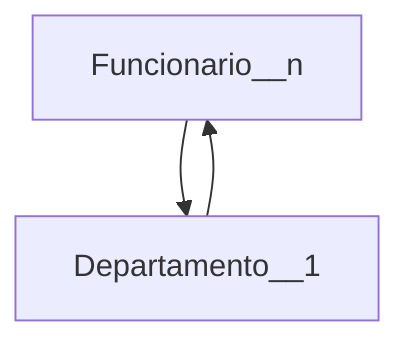
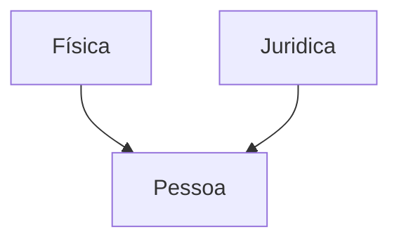

# Apresentação da disciplina
# Revisão de banco de dados
* Princios do B.D
  * eliminar redundâncias, manter apenas as redundâncias controladas
  * reduzir o numeros de chaves estrangeiras
    
## Diagrama Entidade Relacional Conceitual -  desenho
* o que é entidade: representa algo do mundo real
  * representado por um retângulo 
  * exemplo: funcionario, departamento

* relacionamento 
* cardinalidade
    * 1 -- 1
    * 1 -- n
    * n -- n
* atributos
  * simples 
  * compostos - formado por varios atributos 
      * endereço é formado por rua, cep, complemento, numero 
  * multivalorado ?
  * atributo identificador --> tem que ser único e não nulo
    * natural: cpf
    * artificial: id
* herança (seta) 
  * maior nível de abstração
  * uma tabela apenas para os dois tipos de pessoas --> muitos campos ficam nulos
  * gerar duas tabelas para evitar muitos campos null
      * uma tabela para pessoa fisica e outra para pessoa juridica
  * 3 tabelas: uma para id e nome, outra para pessoa fisica com chave estrangeira para a primeira, e uma terceira para pessoa juridica tambem com chave estrangeria para a primeira
  * a escolha da melhor tabela depende do que o projeto pede  

## Diagrama Entidade Relacional Lógico 
* precisa conter as restriçoes de dominios --> tipos dos dados, int, varchar, date,...

## DDL e DML
* DDL - criação tabelas, entidades, ...
* DML - criar, alterar, ...

