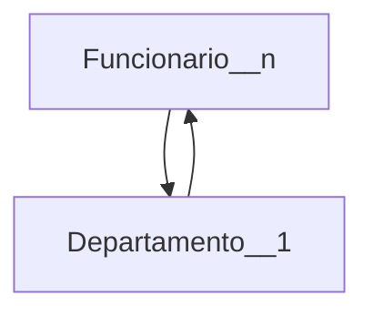
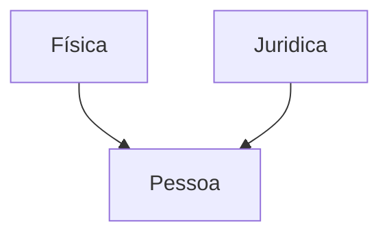

# Apresentação da disciplina
### UNIDADE 1 - BANCO DE DADOS ATIVOS
- Conceitos
- Modelo ECA
- Automatismos
- Utilização em um SGBD convencional
### UNIDADE 2 - SEGURANÇA E INTEGRIDADE
- Conceitos
- Permissões
- Visões
- Procedimentos armazenados
### UNIDADE 3 - BANCO DE DADOS TEMPORAIS
- Conceitos
- Consultas temporais
- Modelo temporais
- Implementação em um SGBD convencional
### UNIDADE 4 - BANCO DE DADOS OBJETO-RELACIONAL
- Conceitos
- Modelo relacional estendido
- Utilizsação em um SGBD convencional
### UNIDADE 5 - OTIMIZAÇÃO DE CONSULTAS
- Conceitos
- Indexação
- Principais algoritmos
### UNIDADE 6 - PROCESAMENTO DE TRANSAÇÕES
- Conceitos
- Controle de concorrência
- Sistema de recuperação
  
# Revisão de banco de dados
### ✦ Banco de dados - BD
* Coleção de dados relacionados, por dados entende-se fatos conhecidos que podem ser armazenados e têm um significado implícito
* Propiedades implícitas de um banco de dados
  * representa algum aspecto do mundo real
  * é uma coleção de dados logicamente coerente
  * é projetado, construído e populado para um propósito específico
* Banco de dados podem ser de qualquer tamanho ou complexidade 
* Principios do B.D
  * eliminar redundâncias, manter apenas as redundâncias controladas
  * reduzir o numeros de chaves estrangeiras
* para definir o banco de dados é necessario definir a estrututra dos registros em cada tabela especificando diferentes tipos de elementos de dados para serem armazenados em cada registro, é necessário ainda definir um tipo de dados para cada coluna da tabela ou atributo 

    
### ✦ Sistema de gerenciamento de banco de dados - SGBD
- é um sistema computadorizado que permite ao usuário criar e manter um banco de dados
- é um software de propósito geral que facilita o processo de definir, construir, manipular e compartilhar banco de dados entre vários usuários e aplicações
- a definição de um banco de dados envolve especificar os tipos de dados, estruturas e restrições nos dados a serem armazenados. A definição dos dados e sua informação descritiva é também armazenada no SGBD na forma de um catálogo do banco de dados, chamado **meta-dados**
- a construção do BD é o processo de armazenar os dados em algum meio controlado pelo SGBD
- a manipulação do BD inclui funções como consultar, atualizar e gerar relatórios sobre o banco de dados
- compartilhamento de um BD permite que múltiplos usuários e programas acessem o banco de dados simultaneamente
- **programa de aplicação** acessa o BD enviando consultas ou requisões de dados ao SGBD
- uma consulta tipicamente seleciona alguns dados para serem recuperados
- uma transação pode levar a alteração nos dados de um BD
- **o banco de dados juntamente com seu sistema gerenciador são chamados de sistema de banco de dados**

#### ★ Vantagens ao utilizar um SGBD
##### ✸ Controle de redendância
- normalização de dados ➔ projeto de banco de dados que armazena cada item lógico de dados em apenas um lugar no BD ➔ assegura consistência e economiza espaço de armazenamento
- problemas gerados pela redundância
  - duplicação de esforço
  - espaço de armazenamento é desperdiçado ➔ grande problema em banco de dados grande
  - arquivos que representam os mesmo dados podem ser inconsistentes 
##### ✸ Restrição ao Acesso não-autorizado
- um SGBD deve prover um subsistema de segurança e autorização o qual o administrador do banco de dados usa para criar contas e especificar restrições de acesso ➔ o SGBD deve assegurar essas restrições automaticamente
- alguns usuários podem ter permissões apenas para leitura dos dados enquanto outros podem fazer alterações
##### ✸ Prover armazenamento persistente para Objetos de Programas
- SGBDs são compatíveis com a linguagens de programação, java,python e c++, e realizam automaticamente todas as conversões necessárias
##### ✸ Prover estruturas de Armazenamento e Técnicas de Busca
- sistema de banco de dados devem prover capacidades para executar consultas e atualizações eficientemente
- banco de dados é armazenado em disco, o SGBD deve prover estrutura de dado especializada e técnicas de busca para acelerar a busca no disco para os registros de interesse
- arquivos auxiliares = índices ➔ frequentemente utilizado para esse propósito
    - são tipicamente baseados em uma estrutura de dados em árvore ou hash que são adequadamente modificadas para busca em disco 
##### ✸ Prover Backup e Recuperação
- SGBD deve prover mecanismos para recuperar de falhas de software ou de hardware
- o subsistema de backup e recuperação de um SGBD é responsável para tal
- exemplo: se um computador desliga no meio de uma transação complexa de atualização, o sistema de recuperação é responsável por assegurar que o banco de dados é restaurado para o estado que estava antes da transação começar a executar
##### ✸ Representar Relacionamentos Complexos entre dados
- um banco de dados deve incluir numerosas variedades de dados que são inter-relacionadas de muitas formas
##### ✸ Impor Restrições de Integridade
- a maioria das aplicações de banco de dados têm restrições de integridade que deve ser atendidas pelos dados
- SGBD de prover capacidades para definir e impor essas restrições
- a restrição de integridade mais simples envolve especificar um tipo de dados para cada item de dados
##### ✸ Implicações Adicionais na Abordagem de Banco de Dados
- impor padrões
    - facilita as comunicações e cooperação entre vários departamentos, projetos e usuários na organização
- tempo de desenvolvimento de aplicação reduzido
    - desenvolvimento de uma nova aplicação, como recuperação de certos dados do BD para um relatório, leva muito pouco tempo  
- flexibilidade
    - pode ser necessário mudar a estrutura do BD ao se mudarem os requisitos
    - exemplo: adicionar uma nova tabela ou ampliar os elementos de dados existentes 
- informação atualizada disponível
    - atualização feita por um usuário é aplicada ao banco de dados, todos os demais usuários têm acesso aos dados atualizados
- economia de escala
    - permite a consolidação de dados ➔ o que gera a redução na quantia de sobreposição entre atividades do pessoal de TI em diferentes projetos bem como a redundância entre aplicações

#### ★ Características da Abordagem de Banco de Dados
- na abordagem de BD, um repositório único mantém os dados que são definidos apenas uma vez e acessados por uma variedade de usuários através de consultas e trasações 
- principais características da abordagem de banco de dados frente à abordagem de processamento de arquivo
##### ✸ Natureza Auto-Descritiva de um Sistema de Banco de Dados
- um sistema de banco de dados não possui apenas o banco de dados mas também uma definição completa da estrutura do banco de dados e suas restrições ➔ é armazenada num catálogo de **meta-dado** do banco de dados
##### ✸ Isolamento entre Programa e Dados
- no processamento de arquivos tradicional, a estrutura dos arquivos de dados é embutida nas aplicações, assi, qualquer mudança na estrutura de um arquivo pode requerer alterações em todos os programas que acessar tal arquivo
##### ✸ Suporte a Múltipla Visões dos Dados
- BD tem muitos tipos de usuários, onde cada qual pode requerer uma visão diferente do Bd
    - uma visão pode ser um subconjunto dos dados ou conter dados virtuais que são derivados dos arquivos do banco de dados mas não são explcitamente armazenados 
##### ✸ Compartilhamento de Dados e Processamento de Transações Multiusuário
- permite que múltiplos usuários acessem o banco de dados ao mesmo tempo
- os SGBDs têm que implementar o controle de concorrência para assegurar que quando vários usuários tentam atualizar os mesmo dados isso seja feito de forma controlada


## Diagrama Entidade-Relacionamento Conceitual -  desenho
* o que é entidade: representa algo do mundo real
  * representado por um retângulo 
  * exemplo: funcionario, departamento
  * 

* relacionamento: ligação entre entidades
    * representado por losango 
* cardinalidade: definem a quantidade de ocorrências que podem existir entre duas entidades
    * 1 -- 1
    * 1 -- n
    * n -- n

* atributos
  * simples: não podem ser subdivididos
  * compostos - formado por varios atributos 
      * exemplo: endereço é formado por rua, cep, complemento, numero 
  * multivalorado: podem ter vários valores para uma mesma entidade
      * exemplo: telefone, uma pessoa pode ter mais de um 
  * atributo identificador: tem que ser único e não nulos que identificam uma entidade
    * natural: já existe no mundo real ➔ cpf
    * artificial: criado para o sistema ➔ id
      
* herança (generalização/especialização)
  * usada para representar quando uma entidade é uma versão mais específica de outra  
  * maior nível de abstração
  * uma tabela apenas para os dois tipos de pessoas --> muitos campos ficam nulos
  * gerar duas tabelas para evitar muitos campos null
      * uma tabela para pessoa fisica e outra para pessoa juridica
  * 3 tabelas: uma para id e nome, outra para pessoa fisica com chave estrangeira para a primeira, e uma terceira para pessoa juridica tambem com chave estrangeria para a primeira
  * a escolha da melhor tabela depende do que o projeto pede  


## Diagrama Entidade-Relacionamento Lógico 
- é uma representação gráfica do modelo lógico de banco de dados
- mostra como as entidades(tabelas), atributos (colunas) e relacionamentos estão estruturados de forma que já se aproxime do que será implementado em SGBD
- detalha melhor: inclui atributos, chaves primárias (PK), chaves estrangeiras (FK), cardinalidades e já organiza os dados pensando na implementação.

### DATA DEFINITION LANGUAGE - DDL
- criar e modificar a estrutura de banco de dados e tabelas
- algus comandos são:
```sql
-- criar banco de dados
CREATE DATABASE
-- excluit banco de dados
DROP DATABASE
-- remover todos os registros de uma tabela sem excluir a tabela em si
TRUNCATE TABLE
-- definir a chave primaria
PRIMARY KEY
```

### DATA MANIPULATION LANGUAGE
- utilizada em sistemas de gerenciamento de banco de dados SQL para manipular dados dentro de tabelas
- algus comandos são:
```sql
-- inserir dados em uma tabela
INSERT
-- modificar registros existentes em uma tabela
UPDATE
-- remover os registros de uma tabela 
DELETE
-- consultar dados de uma tabela
SELECT
-- filtrar registros em comandos SELECT, UPDATE e DELETE
WHERE
```

# SQL BÁsica
- Structured Query Language (SQL) é a linguagem padrão para manipular banco de dados relacionais
  - desenvolvida pela IBM nos anos 70 e adotada pela companhias que desenvolvem SGBDs  
  - usa os termos tabela, linha e coluna para os termos relacionais relação, tupla e atributos, respectivamente
#### CREATE
- criando um banco de dados
```SQL
  CREATE DATABASE nomeBanco;
```
- criando uma tabela
```SQL
  CREATE TABLE nomeTabela;
```
 
#### DROP
- apagando um banco de dados
```SQL
  DROP DATABASE nomeBanco;
```
- apagando uma tabela
```SQL
  DROP TABLE nomeTabela; 
```
#### ALTER
- alteração de uma tabela, com a adição de uma coluna
```SQL
 ALTER TABLE nomeTabela
 ADD nome_coluna tipo_Dado;
```
- alteração de uma tabela, com a remção de uma coluna
```SQL
  ALTER TABLE nomeTabela
  DROP nome_coluna; 
```
- alteração de uma tabela, através da modificação do tipo de atruibuto de uma coluna
```SQL
  ALTER TABLE nomeTabela
  ALTER COLUMN nome_coluna tipo_Dado; 
```
#### SELECT
- usada para selecionar dados de um banco de dados
```SQL
  SELECT coluna
  FROM nomeTabela;
```
#### INSERT INTO
- usada para inserir novos registros em uma tabela, especifique os nomes das colunas e os valores a serem inseridos, ou se for adicionar para todas as colunas não precisa especificar as colunas
```sql
INSERT INTO nomeTabela (coluna1,coluna2)
VALUES (valor1,valor2); 
```
#### UPDATE
- usada para modificar os registros existentes em uma tabela
```sql
 UPDATE nomeTabela
 SET coluna1 = valor1
 WHERE condition; 
```
#### DELETE
- usada para excluir registros existentes em uma tabela
```SQL
 DELETE FROM nomeTabela
 WHERE condition;
```

