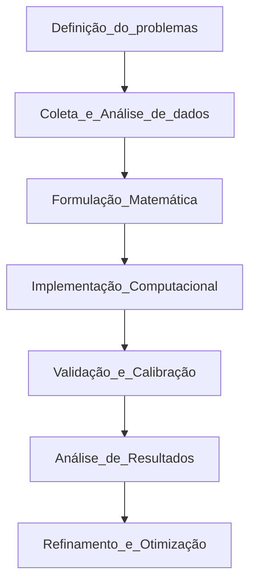

# Apresentação da disciplina
## Objetivos da Disciplinas
* Compreender Modelos
  * entender conceitos fundamentais de construção de modelos computacionais para sistemas reais   
* Aplicar Simulações
  * desenvolver projetos de simulação e analisar comportamento de sistemas complexos 
* Dominar Ferramentas
  * utilizar sofware especializados para criar simulações computacionais eficazes 
* Resolver Problemas
  * aplicar conhecimentos em situações reais da área de computação 
  
## O que é MODELAGEM
* Definição: conjunto de técnicas que traduzem fenômenos reais em representações matemáticas que podem ser simuladas em computadores
* Analogia do mapa: como uma mapa não é o território real, mas uma representação útil que nos ajuda a navergar
  * 🡻
* Modelo computacional: versão simplificada do sistema real que podemos estudar virtualmente
* Objetivo: Criar representações úteis para estudar sistemas complexos

## Conceitos Fundamentais
* Modelo: representação matemaática ou algoritmica de um sistema real
* Simulação: execução do modelo no computador para observar seu comportamento
* Sistema: conjunto de elementos que interagem para alcançar um objetivo comum
* Variáveis características mensuráveis do sistema que podem mudar
* Parâmetros: valores que controlam o comportamento do modelo

## Tipos de Modelagem
Principais abordagens, cada tipo é adequado para diferentes problemas e contextos
### Determinística
* resultado único e previsível para um conjunto de entradas
* para um mesmo conjunto de entradas, o sistema sempre produzirá a mesma saída
* não há incerteza
 * exemplo: cálculo de trajetória de projétil
### Estocástica
* incorpora elementos aleatórios, produzindo diferentes resultados possíveis
* o comportamento futuro não pode ser previsto com certeza, apenas com uma certa probabilidade
* envolvem variáveis aleatórias 
 * exemplo: previsão meteorológica
### Baseada em Agentes
* simula comportamentos individuais que geram padrões coletivos
* autonomia: cada agente age por conta própria, como se fosse um "personagem" com suas próprias regras
* interação: o que acontence no sistema depende das trocas e relações entre os agentes e o ambiente
 * exemplo: comportamento de multidões

## Processo de Modelagem: etapas para criar modelos computacionais
Processo iterativo - sempre refinando e melhorando

* 1 - Definição do problemas: identificar o que queremos estudar e quais perguntas responder
* 2 - Coleta e Análise de dados: reunir informações sobre o sistema e identificar variáveis importantes
* 3 - Formulação Matemática: traduzir o problema em equações e estabelecer simplificações
* 4 - Implementação Computacional: converte o modelo matemático em código executável
* 5 - Validação e Calibração: comparar resultados simulados com dados reais e ajustar parâmetros
* 6 - Análise de Resultados: interpretar resultados, gerar visualizações e extrair insights
* 7 - Refinamento e Otimização: melhorar o modelo baseado nos resultados e explorar cenários

## Sistemas Contínuos
### Mudanças suaves e contínuas
* Características
  * variáveis mudam de forma suave
  * qualquer valor dentro de um intervalo
  * modelados com equações diferenciais
  * tempo como variável contínua
* Exemplos Computacionais
  * Dinâmicade Fluidos:Simulação CFD
  * CircuitosAnalógicos: Modelagem elétrica
  * ControleIndustrial: Processos automáticos
  * FenômenosFísicos:Calor, ondas, lu
* Matemática:
  * Equações diferenciais são equações que relacionam uma função (por exemplo, a posição, temperatura, velocidade, etc.) com suas derivadas (ou seja, com a taxa de variação dessa função em relação ao tempo ou a outra variável).
  * Em outras palavras, elas descrevem como uma quantidade muda continuamente.
  * Por isso, são ideais para representar sistemas onde as variáveis mudam de forma suave e contínua, sem saltos
  * 

* Representação Visual
  * 

* em resumo:
  * variáveis mudam de forma suave e contínua. Isso significa que elas podem assumir qualquer valor dentro de um intervalo, incluindo casas decimais,frações, e valores irracionais.
  * As mudanças ocorrem a todo instante, não em pontos específicos no tempo. como por exemplo em uma temperatura que varia de 20°C para 21°C. Ela passa por 20.1°C, 20.5°C, 20.99°C, etc. Não salta de 20 para 21.
    
### Valores específicicos e saltos
* Características
  * valores específicos(inteiros)
  * mudanças em instantes pontuais
  * equações de diferenças
  * tempo em intervalos discretos 
* Exemplos Computacionais
  *  Redes de Computadores: Pacotes de dados
  *  Sistemasde Filas: Atendimento discreto
  *  Jogos Digitais: Estados do jogo
  *  Sinais Digitais: Processamento DSP
* Matemática:
  *  As variáveis de um sistema discreto só podem assumir certos valores, geralmente inteiros ou contáveis. Por exemplo, o número de pessoas em uma sala pode ser 0, 1, 2, 3... mas nunca 1,5 pessoas
  * 
 
* Representação Visual:
  * 
 
* Mudanças em instantes pontuais
  * As mudanças no sistema acontecem em momentos específicos, chamados de eventos. Entre esses eventos, o sistema permanece no mesmo estado. Por exemplo, a cada chegada ou saída de um cliente em uma fila, o número de pessoas muda 
* Equações de diferenças
  *  Ao invés de usar equações diferenciais (como nos sistemas contínuos), sistemas discretos são modelados por equações de diferenças, que descrevem como o estado do sistema muda de um instante para o outro.
    * Exemplo:  x[n+1]=f(x[n]) = Aqui, x[n] é o valor da variável no instante n, e x[n+1] é o valor no próximo instante. 
* Tempo em intervalo discreto
  *  O tempo é contado em passos ou intervalos separados (por exemplo, t = 0, 1, 2, 3...). Não existe o “meio termo” entre dois instantes, como t = 1,5
## Importância na Computação
* Compreensão
  * sistemas com milhares de variáveis
  * comportamentos emergentes
  * padrões não óbvios   
* Economia
  * redução de custos de prototipagem
  * menor tempo de de desenvolvimento
  * evita experimentos perigosos
* Predição
  * testa cenários futuros
  * avalia impacto de mudanças
  * decisões baseadas em dados 
* Formação
  * raciocínio algoritmico
  * abstração de problemas
  * preparação para IA e Data Science
   
### Exemplos de experimentos perigosos na prática
* indústria química: testar uma reação química nova pode gerar explosões, liberar gases ou causar incêndios. Simular o processo antes evita riscos à vida e ao ambiente
* aeronáutica: simular o que acontece se um avião perde uma asa em voo para estudar o comportamento e planejar respostas
* Engenharia civil: Simular o colapso de uma ponte ou prédio para entender os limites estruturais, sem precisar destruir uma construção real.
* Medicina: Simular o efeito de um novo medicamento ou cirurgia em um modelo virtual do corpo humano, evitando riscos aos pacientes.
* Energia nuclear: Testar falhas em reatores nucleares é extremamente perigoso na vida real, mas pode ser feito com segurança em simulações.
  
## Aplicações práticas
Cada área tem suas própias técnicas e desafios específicos
* Indústria
  * otimização de linhas de produção
  * simulação de fluxos industriais
  * análise de confiabilidade
  * design de produtos virtuais 
* Jogos
  * fisica de jogos realistica
  * simulação de multidões
  * efeitos visuais avançados
  * inteligência artificial 
* Medicina
  * propagação de epidemias
  * descoberta de medicamentos
  * análise de fluxos sanguíneo
  * dinâmica molecular 
* Finanças
  * modelagem de risco financeiro
  * simulação Monte Carlo (inserir valores aleatórios)
  * análise de mercados
  * otimização de portfólios 

## Ferramentas e Tecnologias
* Python
* MATLAB - interface visual amigável
* NetLogo - modelagem baseada em agentes
* Aplicações Específicas
  * R - estátistica e análise de dados
  * Julia - alto desempenho científico
  * AnyLogic - sistemas complexos 
